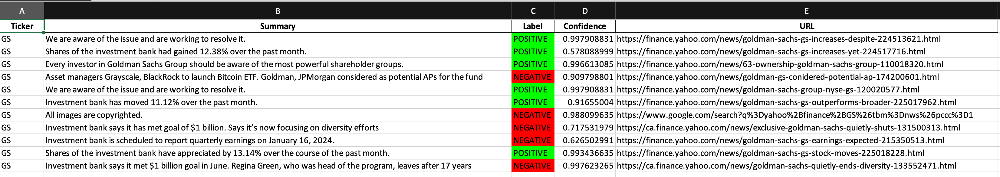

# Automate_Stock_Sentiment_Analysis

This project is designed to analyze news articles related to specific financial tickers
and provide sentiment analysis for each article. It is able to achieve by using Hugging Faces'
Pegasus Model. It scrapes the web urls from yahoo finance, according to the tickers which you can input in, and then
after some cleaning and post-processing, generates a summary of those articles using the Pegasus transformer, and 
calculates its sentiment (positive or negative) which it then displays in a .xlsx format

### Files
- `main.py`: Main script containing the core functionality.
- `news.py`: Module for handling news-related tasks such as searching for articles and cleaning URLs.
- `summarize.py`: Module for summarizing articles using the Pegasus model.
## How to run the program

Make sure you have these dependencies set up:

     pip install beautifulsoup4 requests openpyxl transformers pandas tqdm
To start the program, simply navigate to the folder and run 

    python main.py

Upon running the program, you will be presented with this prompt:

    Enter the tickers you want to monitor (comma-separated):

Simply, enter the tickers you want to analyze as such:

    Enter the tickers you want to monitor (comma-separated): AAPL, JPM, GS

At the end, you will be prompted like this:

    Do you want to print these results to a file? If so, write y, [name of file.xlsx] e.g. y, output.xlsx:

If you want to, simply type y followed by your filename like this:

    Do you want to print these results to a file? If so, write y, [name of file.xlsx] e.g. y, output.xlsx: 
    y, output.xlsx

and a .xlsx file will be created in your directory. 

Here is what a sample outpt .xlsx file would look like for the ticker GS:

### Customization
- You can adjust the `MAX_LEN_FOR_PEGASUS` variable to control the maximum length of articles processed by the summarization model.
- Modify the `exclude_items` list in the `main.py` script to exclude specific words from URLs.